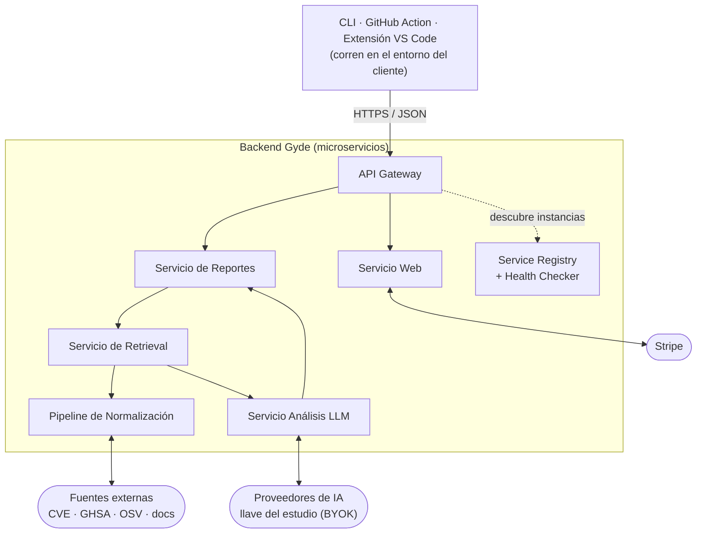

# Gyde

Plataforma SaaS que detecta y gestiona vulnerabilidades, conflictos de licencias y riesgos de compatibilidad en proyectos de videojuegos (Unity y Unreal Engine), apoyándose en bases de datos públicas de vulnerabilidades y en documentación oficial. Se ofrece con planes de suscripción cobrados con Stripe.

> **Estado:** MVP en construcción (5 días, 4 personas). El repositorio contiene la estructura, los contratos, el esqueleto ejecutable de cada componente y la estructura de los patrones de diseño; la **lógica de negocio se reparte por áreas** ([plan del equipo](docs/tasks/00-resumen.md)).
>
> **¿Llegas al equipo?** Lee el [plan del equipo](docs/tasks/00-resumen.md) y el brief de tu área.

## Qué hace

- **El análisis empieza en el entorno del cliente** (CLI, GitHub Action o extensión de VS Code). El código fuente **nunca sale de ahí**: solo viajan nombres de dependencias, versiones y licencias.
- El backend cruza esa información con fuentes públicas (CVE, GHSA, OSV, NVD) y documentación oficial, normalizadas en un esquema común.
- Un LLM, con la llave del propio estudio (BYOK), interpreta y correlaciona la evidencia con el contexto del proyecto.
- El resultado es un reporte de riesgo **priorizado y explicable** (evidencia, impacto, recomendación).
- Si el proveedor de IA falla o no está configurado, el análisis determinístico (vulnerabilidades y licencias) sigue entregando resultados: el sistema **degrada, no se cae**.

## Arquitectura de un vistazo

Estilo de microservicios con aislamiento de fallos. Patrones: Circuit Breaker, Service Discovery (arquitectónicos) y Abstract Factory, Template Method, Decorator (diseño).



## Mapa del repositorio

| Carpeta | Contenido |
|---|---|
| `apps/` | Lo que corre en la máquina del cliente: `cli`, `github-action`, `vscode-extension` |
| `services/` | Un contenedor por carpeta: `gateway`, `web`, `normalization`, `retrieval`, `llm-analysis`, `reports`, `registry` |
| `packages/` | Librerías compartidas: `contracts`, `analysis-engine`, `resilience`, `discovery`, `service-kit`, `design-tokens` |
| `tooling/` | Configuración compartida (TypeScript, ESLint, Prettier, Vitest) |
| `infra/` | Docker Compose, esquemas de PostgreSQL y scripts de desarrollo |
| `fixtures/` | Proyectos Unity/Unreal de ejemplo y respuestas grabadas de fuentes externas |
| `docs/` | Arquitectura, decisiones (ADR), diseño, flujo de trabajo y tareas por área |

## Stack

TypeScript · pnpm + Turborepo · Fastify (servicios) · Next.js (Servicio Web) · PostgreSQL · Docker Compose · Vitest.

## Primeros pasos

Se desarrolla **con Docker** ([ADR 0008](docs/adr/0008-desarrollo-con-docker-primero.md)): las dependencias viven en las imágenes, no en tu carpeta. Necesitas **Docker Desktop** y git; no hace falta instalar Node ni pnpm.

1. Clona el repositorio en una **ruta corta** (por ejemplo `C:\dev\Gyde`) y **fuera de OneDrive**.
2. Crea tu `.env` con secretos locales aleatorios:

   ```bash
   docker run --rm -v "$PWD":/work -w /work node:24-alpine node infra/scripts/bootstrap-env.mjs
   ```

3. Levanta todo y sincroniza tus cambios dentro de los contenedores:

   ```bash
   docker compose -f infra/compose/compose.yaml watch
   ```

4. Comprueba que el gateway responde: `http://localhost:4000/healthz`.

Verificar todo como lo hace el CI (formato, lint, tipos, pruebas y build), sin instalar nada:

```bash
docker build -f infra/docker/dev.Dockerfile --target check .
```

> Las imágenes de Docker están escritas pero **aún no se han construido** en una máquina con Docker encendido: es la primera tarea del Área 1. Más detalles y problemas conocidos en Windows en [`infra/README.md`](infra/README.md).

### Instalar en tu máquina (opcional)

Útil para el autocompletado del editor. Necesitas **Node 24** y **pnpm 11** (`corepack enable`), y una ruta corta fuera de OneDrive:

```bash
pnpm install
pnpm test        # también: lint, typecheck, build, format:check
```

## Documentación

| | |
|---|---|
| [Plan del equipo y tareas](docs/tasks/00-resumen.md) | Reparto, ritmo de 5 días y un brief con prompt por área |
| [Arquitectura](docs/architecture/00-vision-general.md) | Contenedores, flujos, patrones, datos y seguridad |
| [Decisiones (ADR)](docs/adr/README.md) | Por qué se decidió cada cosa |
| [Sistema de diseño](docs/design/sistema-de-diseno.md) | Fuente, paleta, tokens y accesibilidad |
| [Índice completo](docs/README.md) | Todo lo demás |

## Cómo contribuir

Lee [CONTRIBUTING.md](CONTRIBUTING.md): ramas, commits (Conventional Commits), pull requests y reglas de arquitectura. La configuración única de GitHub (protección de `main`, merges, seguridad) está en [`docs/workflow/configuracion-github.md`](docs/workflow/configuracion-github.md). Para reportar una vulnerabilidad: [SECURITY.md](SECURITY.md).

## Licencia

[MIT](LICENSE)
