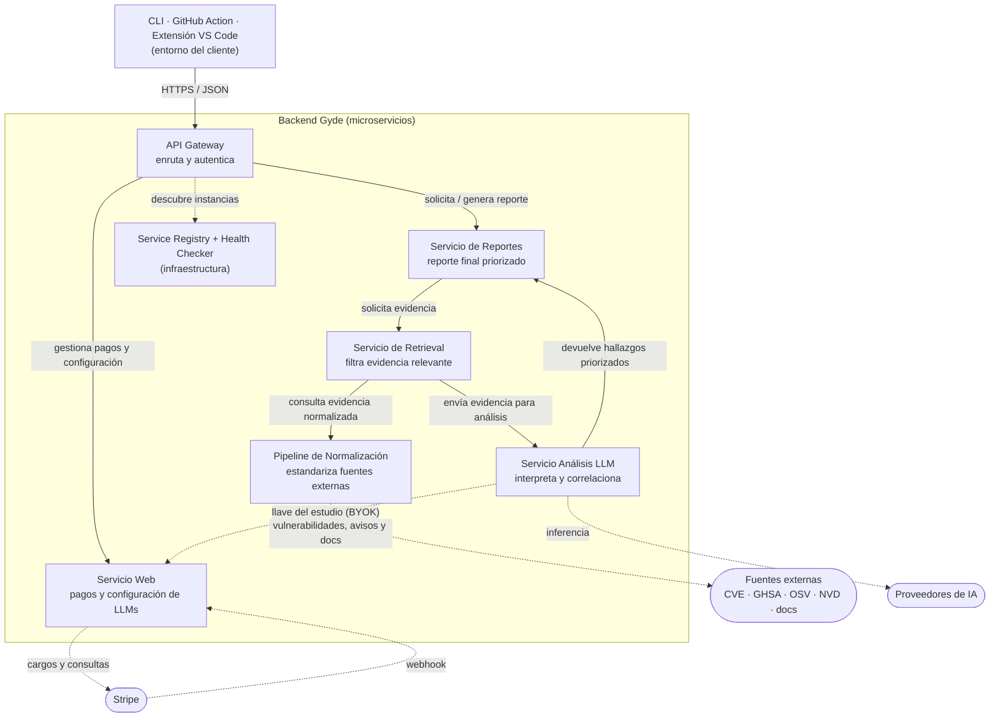

# Visión general de la arquitectura

Gyde es una plataforma SaaS que detecta y gestiona vulnerabilidades, conflictos de licencias y riesgos de compatibilidad en proyectos de videojuegos (Unity y Unreal Engine), apoyándose en bases de datos públicas de vulnerabilidades y en documentación oficial. Se ofrece con planes de suscripción cobrados con Stripe.

Esta carpeta describe **lo que se construye y por qué**. Las fuentes de verdad son el *documento de arquitectura* (PDF), su *presentación* y el *documento explicativo del negocio*; cuando algo no estaba claro o los textos y los diagramas diferían, la decisión tomada está en [`docs/adr/`](../adr/README.md).

| Documento | Contenido |
|---|---|
| [01 Contenedores](01-contenedores.md) | Cada servicio: responsabilidad, puerto, datos, llamadas, endpoints |
| [02 Flujos](02-flujos.md) | Análisis completo, resultado degradado, Circuit Breaker, discovery, Stripe y BYOK |
| [03 Patrones](03-patrones.md) | Dónde vive cada patrón arquitectónico y de diseño, y cómo se prueba |
| [04 Datos, privacidad y seguridad](04-datos-privacidad-seguridad.md) | Qué sale del cliente, quién guarda qué y cómo se protegen las llaves |

## Estilo: microservicios con aislamiento de fallos

Los microservicios permiten aislar módulos que funcionan de forma independiente. Tres razones concretas para Gyde:

- **Aislamiento de fallos con distinta criticidad.** El servicio de análisis determinístico (vulnerabilidades y licencias) debe seguir entregando resultados válidos aunque el proveedor de IA falle: el sistema **degrada, no se cae**.
- **Actualización independiente por tipo de fuente.** El Pipeline de Normalización sincroniza CVE/GHSA/OSV con alta frecuencia sin acoplarse al ciclo de vida del análisis; las fuentes de comunidad (más costosas de filtrar y menos confiables) corren con otra cadencia.
- **Procesos independientes y despliegue independiente.** Cada contenedor expone interfaces claras (REST/JSON) y tiene su propio Dockerfile.

**Costo asumido:** la normalización se vuelve un componente crítico nuevo. Si falla o se desactualiza, degrada la calidad de todo lo que viene aguas abajo, y exige un servicio corriendo de forma periódica e indefinida.

## Diagrama de contenedores

Las flechas con línea continua son llamadas internas síncronas; las punteadas son relaciones externas o de infraestructura. Respecto al diagrama original se añaden dos aristas, ambas decididas en los ADR: `llm-analysis → web` (la llave BYOK del estudio) y el **Service Registry** como contenedor de infraestructura.

## Invariantes (reglas que no se rompen)

1. **El código fuente del cliente nunca sale de su entorno.** Al backend solo viajan nombres, versiones y licencias de dependencias más el contexto técnico del proyecto. Lo impone un esquema estricto en `@gyde/contracts` y una puerta de privacidad en el cliente.
2. **El análisis determinístico no depende de la IA.** Vulnerabilidades, licencias y compatibilidad se calculan sin LLM. Si la IA falla o no está configurada, el reporte sale **degradado**, no fallido.
3. **Toda llamada saliente pasa por un Circuit Breaker** (`@gyde/resilience`), con fallback a la última respuesta válida o a un resultado parcial.
4. **Nadie hardcodea direcciones de servicios:** se descubren en el registry, con URLs estáticas solo como respaldo de desarrollo.
5. **Las llaves de LLM de los estudios (BYOK) se cifran en reposo, no se escriben nunca en logs** y solo viajan por un endpoint interno autenticado.
6. **Cada servicio es dueño de sus datos** (un schema y un rol de PostgreSQL por servicio, sin acceso cruzado).

## Alcance del MVP

**Dentro:** análisis de dependencias, versiones desactualizadas, licencias y compatibilidad (motor + SDK + plataforma) para proyectos Unity y Unreal; reporte priorizado y explicable; suscripciones con Stripe (modo test); API keys; llaves LLM por estudio; CLI, GitHub Action y extensión de VS Code (esta última como esqueleto).

**Fuera:** análisis estático del código fuente del cliente (ningún componente del documento lo hace y contradiría la privacidad), más motores que Unity y Unreal, escalado automático real y despliegue en la nube.

## Glosario

| Término | Significado |
|---|---|
| **Game engine** | Unity o Unreal: el motor del proyecto que se analiza. No confundir con `analysis-engine` |
| **`analysis-engine`** | Paquete del lado del cliente con el pipeline (Template Method) y las fábricas (Abstract Factory) |
| **Tenant** | Un estudio o cuenta. Tiene suscripción, API keys y su propia llave de LLM |
| **BYOK** | *Bring your own key*: cada estudio carga la llave de su proveedor de IA |
| **`KnowledgeObject`** | Elemento de conocimiento normalizado (aviso, *changelog*, documento, issue, licencia) |
| **Determinístico** | Resultado calculado sin IA: misma entrada, misma salida |
| **Degradado** | Reporte entregado sin la capa de IA que se esperaba, indicando el motivo |
| **Entitlements** | Permisos y límites que concede el plan de un tenant |

## Trazabilidad: del documento al repositorio

| Elemento de los documentos | Dónde vive |
|---|---|
| API Gateway · Servicio Web · Pipeline de Normalización · Retrieval · Análisis LLM · Reportes | `services/{gateway,web,normalization,retrieval,llm-analysis,reports}` (1:1 con el diagrama de contenedores) |
| Stripe · fuentes externas (CVE/GHSA/OSV/NVD/docs) · proveedores de IA | Adaptadores en `infrastructure/` de `web`, `normalization` y `llm-analysis`, tras puertos con mocks |
| Fuentes por nivel de confianza (estructuradas / oficiales / comunidad) | `services/normalization/src/infrastructure/sources/{structured,official,community}` |
| Retrieval en tres vías (vulnerabilidades, compatibilidad, licencias) | `services/retrieval/src/domain/analyzers/{vulnerabilities,compatibility,licenses}` |
| **Circuit Breaker** y caché local / fallback | `packages/resilience` |
| **Service Discovery** (Registry, Health Checker, instancias) | `services/registry` y `packages/discovery` |
| **Abstract Factory** (`AnalysisToolchainFactory`, Unity/Unreal) | `packages/analysis-engine/src/toolchain/` |
| **Template Method** (`AnalysisPipeline`) | `packages/analysis-engine/src/pipeline/` y `BaseAnalyzer` en `services/retrieval` |
| **Decorator** (`ReportComponent` y decoradores) | `services/reports/src/domain/report/` |
| GitHub Action · extensión local · CLI | `apps/github-action`, `apps/vscode-extension`, `apps/cli` |
| Protección del código propietario | `@gyde/contracts` (esquema estricto) y `packages/analysis-engine/src/privacy/` |
| Modelo freemium y planes de suscripción | `services/web` (Stripe), `PLAN_CATALOG` en contratos, límites en `gateway`, capas del reporte en `reports` |
| Despliegue independiente de cada contenedor | `services/*/Dockerfile` e `infra/compose/` |
