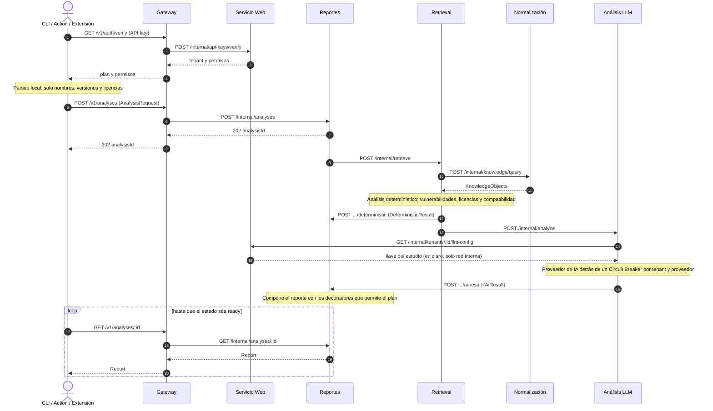
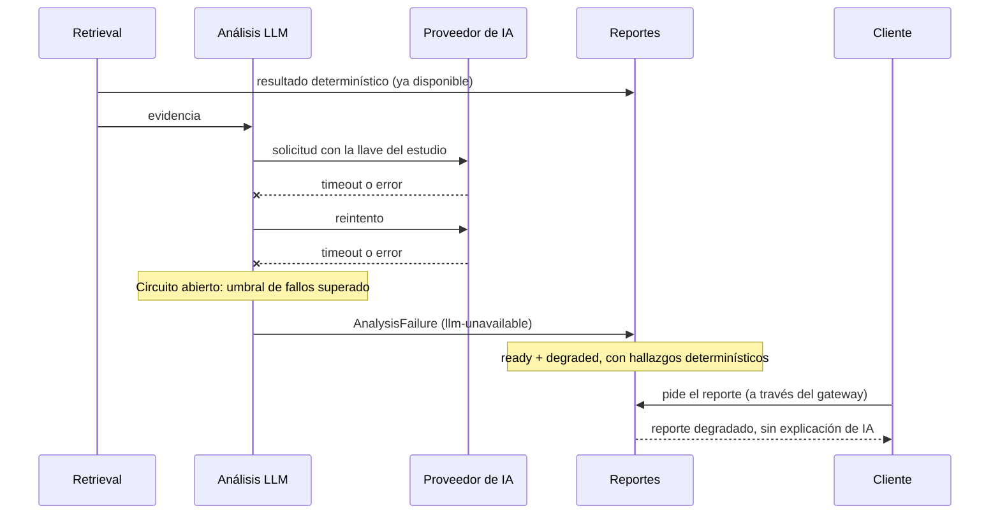
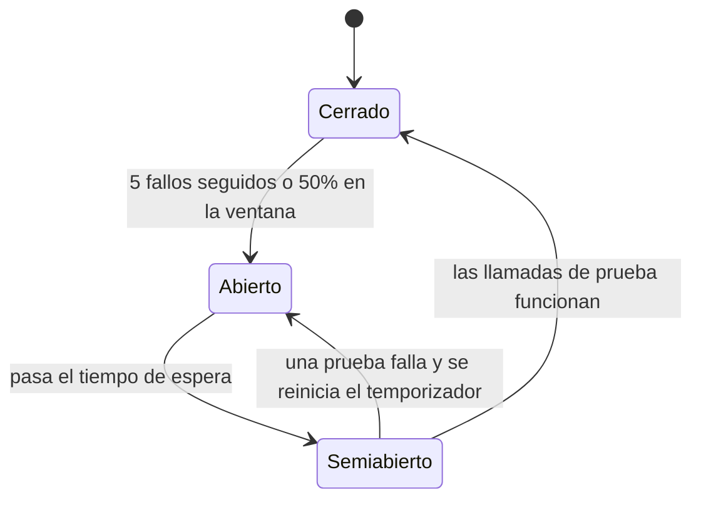
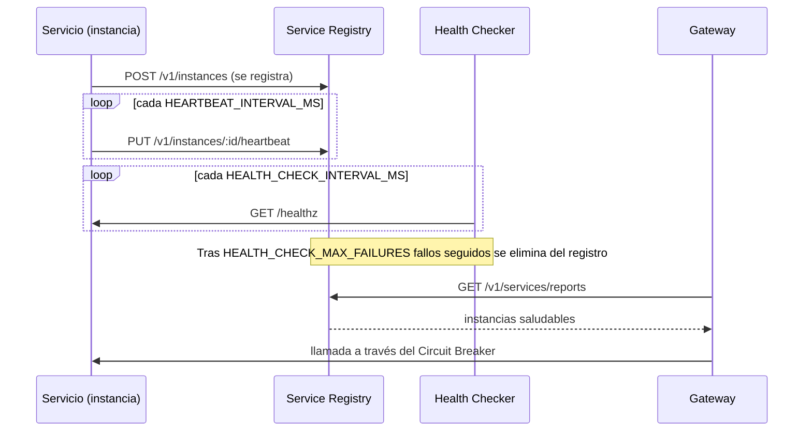
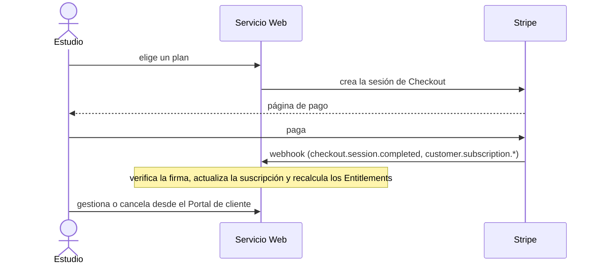
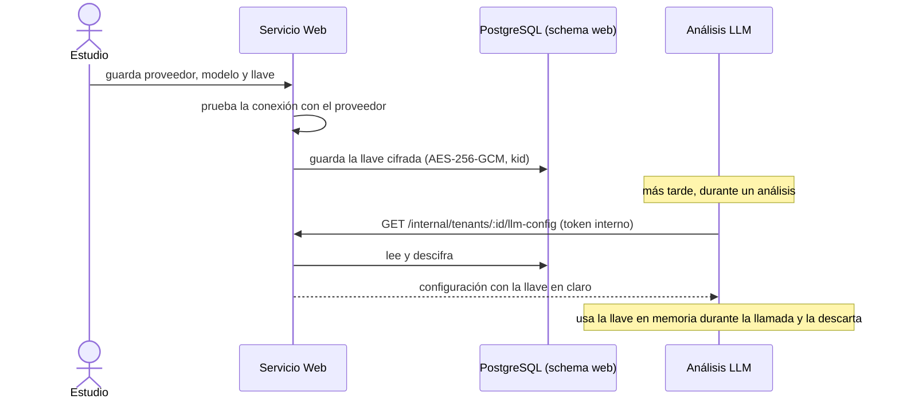

# Flujos

Los diagramas muestran el comportamiento **objetivo** del MVP. Los pasos del Template Method del cliente (autenticar, parsear, vulnerabilidades, licencias, reporte, publicar) se corresponden con los mensajes numerados de abajo; ver [ADR 0004](../adr/0004-el-backend-orquesta-el-analisis.md).

## 1. Análisis completo (camino feliz)

Estados del análisis: `pending → retrieving → analyzing → ready` (o `failed` si falla la recuperación). El cliente publica el resultado al terminar.

## 2. Resultado degradado (la IA falla o no está configurada)

Un reporte es **degradado** solo si se esperaba IA y no pudo correr: `llm-unavailable` (circuito abierto o proveedor caído), `llm-not-configured` (el estudio aún no cargó su llave), `llm-error` (el proveedor respondió con error). Si el plan o el cliente no pidieron IA, el reporte **no** es degradado.

El cliente también degrada: si el gateway no responde, su Circuit Breaker sirve el último reporte guardado en la caché local, marcado como degradado.

## 3. Circuit Breaker

| Situación | Decisión (documento, tabla 3.3) |
|---|---|
| Los fallos superan el umbral (5 fallos o 50 % de las solicitudes en una ventana de tiempo) | Pasa a **abierto**: deja de llamar al servicio y responde de inmediato con el fallback (última respuesta cacheada o mensaje de análisis parcial) |
| Transcurre el tiempo de espera en abierto | Pasa a **semiabierto**: permite un número limitado de solicitudes de prueba |
| Las pruebas tienen éxito | Vuelve a **cerrado** y reanuda el tráfico normal |
| Las pruebas fallan | Vuelve a **abierto**, reiniciando el temporizador |
| El Health Checker detecta una instancia que no responde | El registry la elimina del listado |
| No hay ninguna instancia saludable | El cliente recibe un error controlado o un resultado degradado, sin bloquear el pipeline completo |

El breaker de las llamadas a proveedores de IA es **por tenant + proveedor**: con BYOK, un rate limit o una llave inválida de un estudio no debe abrir el circuito de los demás.

## 4. Registro y descubrimiento de servicios

Si el registry no responde, `@gyde/discovery` cae a las URLs estáticas del entorno (`*_URL`), de modo que el desarrollo local y un registry caído no detienen el sistema.

## 5. Suscripción con Stripe

El webhook es la **única** fuente de verdad del estado de la suscripción; la UI nunca asume un pago por haber vuelto de Checkout. Se desarrolla solo con llaves de modo test.

## 6. Llave LLM del estudio (BYOK)

Controles y modelo de amenazas en [04 Datos, privacidad y seguridad](04-datos-privacidad-seguridad.md).
