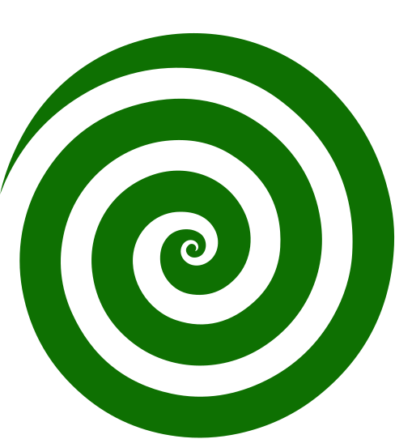

# Sistema de diseño

Interfaz **limpia y agradable**, de paleta **verde y blanco**, con una tipografía **distintiva que transmite comodidad**. Todo lo de abajo está implementado como tokens en [`@gyde/design-tokens`](../../packages/design-tokens/README.md): no copies valores a mano, usa las variables `--gyde-*`.

## 1. Principios

1. **Calma y claridad.** Gyde habla de riesgos; la interfaz no debe asustar. Mucho aire, jerarquía clara, un solo color de marca.
2. **Comodidad.** Radios generosos, sombras suaves, movimiento breve y un tipo de letra de formas abiertas.
3. **El color nunca está solo.** La severidad se comunica con color **y** con ícono y texto.
4. **Accesible por defecto.** Contraste WCAG AA como mínimo, foco siempre visible, respeto de `prefers-reduced-motion`. Los tokens lo comprueban con pruebas automáticas.

## 2. Identidad heredada de la presentación

La presentación del proyecto ya usaba el verde `#0E7002`, el menta `#E1FEDE`, la tipografía *Anton* y una **espiral verde** como motivo. Se conservan el verde, el menta y la espiral; *Anton* (muy condensada y de impacto) se reemplaza en la interfaz por una familia más cómoda, pero con carácter.

`docs/design/assets/spiral.svg` es la marca **provisional** (la espiral del deck). Se usa en verde de marca sobre fondo claro, con espacio libre alrededor igual a la mitad de su ancho.

## 3. Tipografía

| Rol | Familia | Uso | Pesos |
|---|---|---|---|
| **Títulos** | **Bricolage Grotesque** | Encabezados, cifras destacadas, marca | 600–800 |
| **Texto e interfaz** | **Figtree** | Cuerpo, formularios, tablas, botones | 400–600 |
| **Código y evidencias** | **JetBrains Mono** | Versiones, comandos, identificadores, fragmentos | 400–600 |

- Bricolage Grotesque conserva el carácter de los títulos del deck con formas más abiertas y amables; Figtree es humanista y cómoda en lectura larga; JetBrains Mono distingue bien `0/O` y `1/l` en versiones y hashes.
- Las tres son **Google Fonts con licencia OFL**. Se cargan con `next/font` en el Servicio Web (autoalojadas en el build, sin pedir nada a Google en tiempo de ejecución).
- Si una fuente no carga, los tokens ya definen la pila de respaldo (`system-ui`, etc.).

**Escala** (`font.size.*`, base 16 px): 12 · 14 · 16 · 18 · 20 · 24 · 30 · 36 · 48 · 60. Interlineado: `tight` 1.15 (títulos) · `snug` 1.3 · `normal` 1.5 (texto) · `relaxed` 1.65 (lectura larga). Las etiquetas en mayúsculas llevan `letter-spacing.wide`.

## 4. Color

### Primitivos (`palette.*`)

| Escala | Valores |
|---|---|
| **Verde de marca** `green` | 50 `#F3FCF1` · 100 `#E1FEDE` · 200 `#BFF0B8` · 300 `#8FDB84` · 400 `#55BE48` · 500 `#2F9E20` · **600 `#0E7002`** · 700 `#0B5A02` · 800 `#094501` · 900 `#062F01` · 950 `#031A00` |
| **Neutros con tinte verde** `ink` | 50 `#F6F8F5` · 100 `#E8EFE6` · 200 `#D3DDD0` · 300 `#A8B6A5` · 400 `#7A8A77` · 500 `#5F705C` · 600 `#4A5A47` · 700 `#34432F` · 800 `#1F2C1C` · 900 `#0F1B0D` |
| **Blanco** | `#FFFFFF` |
| **Severidad** | crítica `#B42318` · alta `#C2410C` · media `#955A06` · baja `#1D5FA8` · info `#4A5A47`, cada una con su tinte de fondo |

### Semánticos (`color.*`, lo que usan los componentes)

| Token | Valor | Uso |
|---|---|---|
| `color.bg.canvas` | `green.50` | Fondo de página |
| `color.bg.surface` | blanco | Tarjetas, entradas, diálogos |
| `color.bg.brand-subtle` | `green.100` | Chips, selección, resaltados |
| `color.fg.default` | `ink.900` | Texto principal |
| `color.fg.muted` | `ink.600` | Texto secundario |
| `color.fg.subtle` | `ink.500` | Placeholders y pistas |
| `color.fg.brand` | `green.600` | Enlaces y acentos |
| `color.action.primary.bg` / `.bg-hover` / `.bg-active` | `green.600` / `700` / `800` | Botón principal |
| `color.border.control` | `ink.400` | Borde de entradas y controles |
| `color.border.subtle` | `ink.200` | Divisores decorativos |
| `color.focus.ring` | `green.600` | Anillo de foco |

### Contraste (medido; lo verifican las pruebas de `design-tokens`)

| Par | Contraste | Requisito |
|---|---|---|
| Texto principal sobre blanco | 17.75:1 | AAA |
| Texto secundario (`ink.600`) sobre blanco | 7.38:1 | AAA |
| Placeholder (`ink.500`) sobre blanco | 5.30:1 | AA |
| Blanco sobre botón principal (`green.600`) | 6.29:1 | AA |
| Blanco sobre botón en hover (`green.700`) | 8.48:1 | AAA |
| Enlace `green.600` sobre blanco / sobre el fondo de página | 6.29:1 / 5.99:1 | AA |
| `green.700` sobre `green.100` (chips) | 7.84:1 | AAA |
| Borde de controles (`ink.400`) sobre blanco / fondo de página | 3.67:1 / 3.49:1 | ≥ 3:1 (WCAG 1.4.11) |
| Severidades sobre su tinte | ≥ 4.5:1 | AA |

## 5. Espaciado, forma y movimiento

- **Espaciado:** base de 4 px (`space.1` = 4 px … `space.24` = 96 px).
- **Radios:** `sm` 6 · `md` 10 · `lg` 16 · `xl` 24 · `pill`. Controles y tarjetas usan `md`/`lg`: formas suaves.
- **Sombras:** `sm`, `md`, `lg` teñidas de verde oscuro; `shadow.focus` para el anillo de foco.
- **Movimiento:** 120 / 200 / 320 ms con `cubic-bezier(0.2, 0.8, 0.2, 1)`; con `prefers-reduced-motion` las duraciones se reducen a casi cero automáticamente.
- **Breakpoints:** 640 · 768 · 1024 · 1280 px. Diseño **móvil primero**; sin scroll horizontal en 375 px.

## 6. Reglas de uso

- Los componentes usan tokens **semánticos** (`color.*`), nunca la paleta directa: así un tema oscuro solo remapea `color.json`.
- Un solo color de marca. El verde se reserva para acciones principales y acentos; no lo uses como "éxito" y "marca" a la vez en la misma pantalla sin distinguirlos.
- **Severidad:** badge con color + ícono + etiqueta (`Crítica`, `Alta`, `Media`, `Baja`, `Info`). Orden siempre de más a menos grave.
- **Foco visible** en todo elemento interactivo (anillo `color.focus.ring` + `shadow.focus`). Nunca `outline: none` sin reemplazo.
- Áreas táctiles de al menos 44 × 44 px en móvil.
- Texto de enlace distinguible sin depender solo del color (subrayado o peso).
- Fuente monoespaciada para versiones, comandos e identificadores (`1.4.0`, `GHSA-…`, `gyde analyze`).

## 7. Componentes base del MVP

Construidos sobre primitivos accesibles (por ejemplo shadcn/ui o Radix) y tematizados con los tokens:

| Componente | Notas |
|---|---|
| Button | primario, secundario, fantasma y peligroso; estados hover, activo, foco, deshabilitado y carga |
| Input, Select, Textarea | borde `color.border.control`, etiqueta visible, mensaje de error asociado |
| Card | fondo `surface`, radio `lg`, sombra `sm` |
| **SeverityBadge** | color + ícono + etiqueta |
| Table | encabezados claros, filas con `bg.subtle` alterno, versiones en monoespaciada |
| Tabs, Dialog, Toast | con manejo de teclado y foco atrapado en diálogos |
| Navbar y Sidebar | navegación del dashboard |
| EmptyState | ilustración sencilla y una acción clara |
| **CopyField** | para mostrar una API key una sola vez, con botón de copiar |
| **DegradedBanner** | aviso amable cuando el reporte no incluye la capa de IA y por qué |
| CodeBlock | monoespaciada, con botón de copiar |

## 8. Pantallas del Servicio Web (MVP)

1. **Inicio y precios:** propuesta de valor, privacidad ("tu código no sale de tu entorno") y los tres planes.
2. **Iniciar sesión** con GitHub.
3. **Panel:** plan actual, uso del mes y pasos de arranque (instalar la Action o el CLI).
4. **API keys:** crear (se muestra una sola vez), listar con prefijo y últimos 4, revocar.
5. **Facturación:** cambio de plan (Stripe Checkout) y portal de cliente.
6. **Llave de IA:** proveedor, modelo, llave (solo escritura), probar conexión, últimos 4, revocar.
7. *(Opcional)* **Visor de reporte:** hallazgos por severidad con evidencia, impacto y recomendación.

## 9. Voz y tono

Español claro, cercano y tranquilizador; sin jerga innecesaria ni alarmismo. Dice qué pasa, por qué importa y qué hacer.

| En vez de… | Escribe… |
|---|---|
| "ERROR: LLM_NOT_CONFIGURED" | "Aún no configuraste tu llave de IA. Tu reporte incluye los hallazgos de vulnerabilidades y licencias; agrega tu llave para sumar las explicaciones." |
| "Vulnerabilidad crítica detectada" | "`Acme.Serialization 1.4.0` tiene una vulnerabilidad alta. Actualiza a 1.5.0 o posterior." |
| "Límite excedido" | "Llegaste al límite de 30 análisis de tu plan Free este mes. Pasa a Pro para seguir analizando." |

## 10. Lista de comprobación para cada pantalla

- [ ] Usa solo tokens semánticos (`var(--gyde-color-…)`).
- [ ] El contraste de cada texto y control cumple los mínimos de la sección 4.
- [ ] La severidad lleva ícono y etiqueta además del color.
- [ ] Se puede usar completa con teclado y el foco siempre se ve.
- [ ] Se ve bien en 375 px de ancho, sin scroll horizontal.
- [ ] Los textos están en español y explican el siguiente paso.
