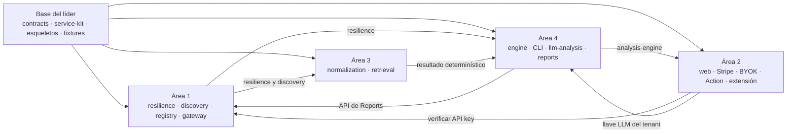

# Plan del equipo: 4 áreas, 5 días

Este documento es el **punto de partida**. Léelo completo y luego abre el brief de tu área. Cada brief tiene objetivo, archivos que puedes y que no puedes tocar, criterios de aceptación, dependencias con las otras áreas y un **prompt listo para pegar** en tu asistente de código (los prompts completos por persona están en [`prompts/`](prompts/README.md)).

## Áreas y reparto

Una persona por área. El tamaño es relativo: S pequeño · M mediano · L grande.

| Área | Módulos | Tamaño | Responsable |
|---|---|---|---|
| **1. Plataforma, Gateway y Resiliencia** ([brief](area-1-plataforma-y-borde.md)) | `resilience`, `registry`, `discovery`, `gateway`; mantiene `infra/` y el CI | M + S + S + M | @FatimaCas (Fatima Castro) |
| **2. Web, Pagos y Superficies** ([brief](area-2-web-pagos-y-superficies.md)) | `web` (Stripe, API keys, BYOK), `design-tokens`, `github-action`, `vscode-extension` | L + S + S-M + S | @kicconsu (Samuel Camargo) |
| **3. Conocimiento** ([brief](area-3-conocimiento.md)) | `normalization`, `retrieval` | L + L | @Bokter (Juan Rojas) |
| **4. Motor, LLM y Reportes** ([brief](area-4-motor-llm-y-reportes.md)) | `analysis-engine` + `cli`, `llm-analysis`, `reports` | M-L + S + M + M | @JDBorjaC (Juan David Borja) |

## Qué ya está hecho (base del líder)

No empiezas de cero. Ya existen, probados y verdes en el CI:

- **`@gyde/contracts`**: todos los mensajes entre piezas (zod), rutas, planes y muestras para mocks. La privacidad está en el esquema estricto.
- **`@gyde/service-kit`**: arranque común de servicios (salud, errores estándar, logger que censura secretos, guardas de token interno, rutas stub).
- **Esqueleto ejecutable de cada servicio y app**: responden `/healthz`; sus endpoints están declarados como stubs `501` que ya validan el cuerpo. Los criterios de aceptación pendientes están como `it.todo` en las pruebas de cada módulo.
- **Estructura de los patrones** de diseño: Template Method (pipeline y analizadores), Abstract Factory (Unity/Unreal) y Decorator (reportes), con pruebas de arquitectura.
- **`@gyde/design-tokens`** (con pruebas de contraste), **fixtures** sintéticos, **ADRs** y documentos de arquitectura.
- **Infraestructura Docker** y `docker compose`: `compose.yaml` pasa `docker compose config`, pero **las imágenes aún no se han construido** (primera tarea del Área 1).

Lo que **no** está hecho: la lógica de negocio. Eso es lo que se reparte aquí.

## Demo E2E del MVP (criterio de éxito)

Una demostración que ejercita todos los componentes y los dos patrones arquitectónicos:

1. `docker compose up` deja saludables PostgreSQL, el registry y los servicios; el registry lista las instancias.
2. En la web: iniciar sesión con GitHub, **elegir un plan con Stripe (modo test)**, crear una **API key** y **guardar la llave de IA** del estudio.
3. `gyde analyze fixtures/projects/unity-sample` (con esa API key) imprime un reporte priorizado: `Acme.Serialization` con la vulnerabilidad alta, `Acme.GplToolkit` con el riesgo de licencia, y la explicación de IA.
4. **Apagar `llm-analysis`**: repetir el análisis. El reporte sale **degradado** pero con los hallazgos determinísticos; tras 5 fallos el **Circuit Breaker** abre y el resultado llega al instante.
5. Revisar en el registry que la instancia caída desaparece (Health Checker).
6. Verificar con una captura de la solicitud que **no viaja** código fuente (la marca `PROPRIETARY_MARKER_DO_NOT_SEND` no aparece).

## Quién desbloquea a quién

| Entrega | De → a | Para el día | Mientras tanto |
|---|---|---|---|
| `CircuitBreaker` + `MemoryFallbackCache` | Área 1 → Áreas 3 y 4 | **Fin del día 1** | Usa la interfaz tipada; envuelve con una función que llama directo |
| `RegistryClient` (resolve/pick/static) | Área 1 → todos | Día 2 | Usa las URLs estáticas `*_URL` |
| `POST /internal/api-keys/verify` | Área 2 → Área 1 | Día 2 | El gateway usa un servidor simulado con `VerifyApiKeyResponse` |
| `POST /internal/analyses` y `GET /internal/analyses/:id` | Área 4 → Área 1 | Día 2 (versión simple) | El gateway usa un servidor simulado con `@gyde/contracts/samples` |
| `GET /internal/tenants/:id/llm-config` | Área 2 → Área 4 | Día 3 | `llm-analysis` usa un proveedor de config falso |
| `POST /internal/retrieve` publicando `DeterministicResult` | Área 3 → Área 4 | Día 3 | Reports prueba con `DeterministicResult` de muestra |
| `@gyde/analysis-engine` usable | Área 4 → Área 2 (Action) | Día 3 | La Action usa un `AnalysisGateway` falso |

**Regla:** si dependes de algo que aún no existe, **no esperes**: simula al vecino con los datos de `@gyde/contracts/samples` y el contrato, y avanza. La integración real es el día 4.

## Ritmo de 5 días

| Día | Foco |
|---|---|
| **1** | Todos: entorno Docker funcionando, leer su brief, primeras PRs pequeñas. Área 1: Circuit Breaker + cachés y registry. Área 2: arrancar la app Next.js y la autenticación. Área 3: esquema, repositorio y adaptador OSV con fixtures. Área 4: parsers Unity y ciclo de vida de Reports |
| **2** | Cada área completa su camino principal contra mocks. Se publican las entregas del día 2 de la tabla anterior |
| **3** | Funcionalidad completa por módulo; Stripe y BYOK; analizadores; cliente HTTP; llm-analysis. Se publican las entregas del día 3 |
| **4** | **Integración E2E** (ver abajo). Se arreglan los cruces entre áreas |
| **5** | Demo, pulido, documentación y recortes. Nada nuevo, salvo bugs |

## Línea de recorte (si hay retraso)

| Debe estar (camino E2E) | Debería | Podría |
|---|---|---|
| contracts · service-kit · gateway (auth + enrutado) · registry + discovery básicos · resilience (breaker + caché) · web (login, API keys, checkout y webhook de Stripe, guardar llave LLM) · normalization (OSV) · retrieval (vulnerabilidades + licencias) · llm-analysis (mock + un proveedor real) · reports (Basic + Severidad + IA, Markdown) · analysis-engine + CLI (Unity) | GitHub Action · analizador de compatibilidad · decorador de licencias a fondo · parser de Unreal · prueba de conexión y rotación de la llave | Extensión de VS Code · visor de reporte en la web · fuentes de documentación y comunidad más allá del esqueleto · caché de archivo · Redis |

Se recorta **de derecha a izquierda**. Avisen en la sincronización diaria, no el último día.

## Reglas del equipo

1. **Privacidad:** el código fuente del cliente nunca sale. No relajes `AnalysisRequest`.
2. **Contrato primero:** cambia `@gyde/contracts` en un PR chico, revisado por otra área.
3. **Capas:** `http → application → domain`, `infrastructure → application`. ESLint lo comprueba.
4. **Secretos:** nada de llaves en el repo ni en logs. Stripe solo en modo test.
5. **Trabaja en tu carpeta.** Si necesitas algo de otra área, abre un issue o un PR pequeño y avisa.
6. **PRs pequeños y frecuentes** (menos de un día) **hacia `dev`**, con el título en Conventional Commits. Nadie empuja directo a `dev` ni a `main`; el líder lleva `dev` a `main` en cada hito. Ver [`CONTRIBUTING.md`](../../CONTRIBUTING.md).
7. **Convierte los `it.todo` en pruebas reales** a medida que implementas: son tus criterios de aceptación.
8. **Sincronización diaria de 15 minutos:** qué terminé, qué sigue, qué me bloquea.

## Día de integración (día 4)

- [ ] `docker build -f infra/docker/dev.Dockerfile --target check .` pasa en `dev`.
- [ ] `docker compose up` deja todo saludable; el registry lista las instancias.
- [ ] El gateway valida la API key contra Web y reenvía a Reports.
- [ ] Reports → Retrieval → Normalization y → llm-analysis funcionan con datos reales de los fixtures.
- [ ] El CLI imprime el reporte de `unity-sample` de punta a punta.
- [ ] Apagar `llm-analysis` produce un reporte degradado; el breaker abre y se recupera.
- [ ] Stripe (modo test): el webhook cambia el plan y los límites cambian.
- [ ] Lista de errores cruzados abierta como issues, con dueño.

## Definición de terminado del MVP

- La demo E2E de arriba funciona sin intervención manual fuera de lo descrito.
- `dev` y `main` tienen el CI en verde y cada servicio arranca desde su imagen; el último release `dev → main` queda hecho.
- Los `it.todo` del camino "Debe estar" son pruebas reales y verdes.
- Los README de cada módulo describen lo que realmente hace.
- No hay secretos en el historial y la privacidad está cubierta por pruebas.
